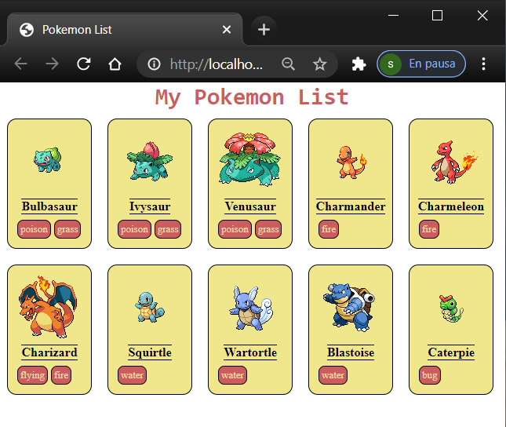

# Lista de Pokemon

Este repositorio es una web con un listado de Pokemon. Es un ejercicio realizado con [React](https://es.reactjs.org/), que forma parte del curso de formación de la [Asociación Adalab.](https://adalab.es/)

# Objetivo principal: **aprender**

- Crear una aplicación React.
- TGestionar datos en el archivo data.json.
- Pintar con JavaScript una tarjeta con la información de un pokemon.
- Pintar todas las tarjetas.
- Usar 3 componentes JS principales: App, PokeList y Pokemon.
- Ajustar la maquetación al diseño.
- Publicar el [ejercicio][beta] en GitHubPages

## Cómo instalarlo

1. Copiar el enlace del repositorio y clonarlo con `git clone`
1. Necesitarás tener instalado Node.js
1. Instalar de forma global la utilidad React
   1. `npm install -g create-react-app`
   1. `create-react-app my-react-project`
1. Si ya tenías instalada la utilidad de forma global, solo ejecuta: `npm install`
1. Ejecutar `npm start` para empezar

## Cómo funciona

Versión en desarrollo: [¡click aquí!][beta]

## Feedback y contribución:

¿Te interesa el proyecto? Si tienes sugerencias, dudas, ideas o te apetece comentar algo, adelante por favor. Puedes hacerlo a través de las _issues_ de este repositorio o contactándome por [email](mailto:saramartinezaragon@gmail.com) o [linkedin](https://www.linkedin.com/in/saramartara/).

---

[][beta]

---

# My Pokemon List

This repository is a website with a list of Pokemon. It is an exercise carried out with [React] (https://es.reactjs.org/), at bootcamp [Adalab Association] (https://adalab.es/)

## Main objective: **to learn**

- Create a React application.
- Manage data in the data.json file.
- Render with JavaScript a card with the information of a pokemon.
- Render all the cards.
- Use 3 main JS components: App, PokeList and Pokemon.
- Adjust the layout to the design.
- Publish the [exercise] [beta] in GitHubPages.

## How to

Develop version: [Click here!][beta]

1. Copy the repository link and clone it with `git clone`.
1. You will need to have [Node.js](https://nodejs.org/es/) installed.
1. To install the React utility globally:
   1. `npm install -g create-react-app`
   1. `create-react-app my-react-project`
1. If you already had the utility installed, just run: `npm install`
1. Run `npm start` to start

## Feedback y contribución:

¿Te interesa el proyecto? Si tienes sugerencias, dudas, ideas o te apetece comentar algo, adelante por favor. Puedes hacerlo a través de las _issues_ de este repositorio o contactándome por [email](mailto:saramartinezaragon@gmail.com) o [linkedin](https://www.linkedin.com/in/saramartara/).

---

[beta]: https://saramartara.github.io/Pokemon-list_module-3/
